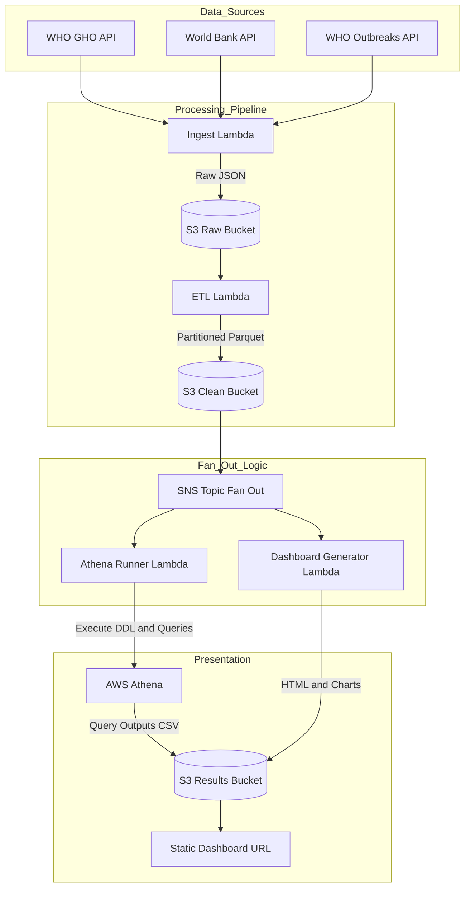
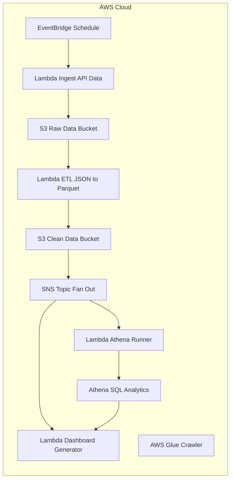

# Project 03: Public Health Data Lake

## Overview

This project implements a cloud-ready public health data lake for ingesting, normalizing, querying, and visualizing global health indicators from the World Health Organization (WHO) and World Bank. It is designed to be environment-agnostic and reproducible: the same Python/SQL logic runs locally (via DuckDB) or on AWS (S3 + Athena). In practice, a scheduled AWS Lambda fetches raw API data into an S3 raw zone, a second Lambda transforms and writes Parquet to an S3 clean zone, an SNS topic fans out triggers to parallel processes, Athena tables enable SQL analytics, and an automated dashboard Lambda generates static HTML reports. All artifacts (data, query results, charts) are treated as append-only evidence for auditability.

## Architecture

### High-Level Architecture



### AWS Cloud Architecture



### Key Architecture Feature

The SNS Topic Fan Out mechanism enables parallel execution of Athena queries and Dashboard generation, significantly improving pipeline efficiency and reducing total processing time.

## High-Level Flow

1. **Ingest** – Fetch raw public health data (APIs)
2. **ETL** – Normalize and harmonize datasets into analytics-ready form
3. **Storage** – Raw and clean data stored in S3 (cloud) or local equivalents
4. **Query** – SQL templates materialized for Athena (or DuckDB locally)
5. **Dashboard** – Charts and indicators built from query outputs
6. **Evidence** – Logs, query results, and screenshots captured for audit

The same Python and SQL logic is used locally and in AWS.

## Project Goals

- **Data Ingestion**: Fetch WHO and World Bank indicator data (e.g. malaria, life expectancy, cholera, hospital beds) via public APIs.
- **ETL & Normalization**: Parse and harmonize raw JSON into clean, partitioned Parquet files (year=YYYY) in S3.
- **Query & Analytics**: Define Athena tables (via Glue) over the clean data to support standard SQL queries.
- **Dashboard Visualization**: Automatically build charts from query outputs into interactive, timestamped HTML dashboards (Plotly).
- **Reproducibility & Audit**: Maintain local ↔ cloud parity and append-only evidence (logs, query results, CSV/JSON exports, dashboards) to ensure every run is auditable.

## Repository Structure

```
project-03-public-health-datalake/
├── cloud/                 # AWS infrastructure (IaC templates, generated artifacts, scripts)
│   ├── templates/         # Authoritative CloudFormation/SAM YAML (editable)
│   ├── generated/         # Auto-generated deployment files (do not edit)
│   └── scripts/           # Orchestration: bootstrap.sh, deploy.sh, run_pipeline.sh
├── src/                   # Core Python logic (cloud-agnostic where possible)
│   ├── _shared/common/    # Shared utilities (config, logging)
│   ├── ingest/            # API fetching, raw storage (app.py, local_test.py)
│   ├── etl/               # Normalization to Parquet (normalize_healthdata.py)
│   ├── athena_runner/     # Query orchestration (Athena/DuckDB adapters)
│   ├── dashboard/         # Visualization (build.py, charts.py, load_data.py)
│   ├── evidence/          # Manifest writing for audits
│   └── debug*.py          # Debugging helpers
├── local_run/             # Isolated local sandbox (simulates cloud without AWS)
│   ├── .local_venv/       # Virtual env (git-ignored)
│   ├── src/               # Local orchestration (imports from ../src)
│   ├── local_data/        # Local filesystem storage (raw/clean)
│   ├── local_sql/         # DuckDB-compatible SQL queries
│   ├── evidence/          # Local outputs (CSVs, dashboard HTML)
│   ├── scripts/           # Local utils (run_local_simulation.sh)
│   └── requirements.*     # Locked deps for reproducibility
├── notebooks/             # Exploratory Jupyter (non-prod)
├── evidence/              # Cloud evidence (athena CSVs, dashboard)
├── LOCAL_RUN.md           # Local workflow guide
├── makefile               # Automation for local setup/run
├── requirements.local.*   # Local deps
└── README.md              # This file
```

### Key Design Rules

- **Templates are never executed directly**
- **Generated files are never edited manually**
- **Evidence is append-only**
- **src/** must remain cloud-agnostic
- **Generated/Append-Only Folders**: `cloud/generated/`, `local_run/evidence/`, `evidence/` – Never edit manually; they capture audits.
- **Versioned/Editable**: `cloud/templates/`, `src/`, `local_sql/` – Core logic here.

## Tech Stack

- **Language & Libraries**: Python 3.9 with Pandas, NumPy, requests, pycountry, etc. Local analytics use DuckDB to run Athena-compatible SQL. Dashboards use Plotly Express (static HTML).
- **AWS Services**: S3 buckets (for raw and clean zones), AWS Lambda (ingestion, ETL, and dashboard functions), Amazon Athena (SQL queries) and AWS Glue (schema crawler). Infrastructure is provisioned via AWS SAM (CloudFormation), and CLI scripts manage deployments and evidence capture.
- **Data Formats**: Source data is JSON (OData/API responses); output data is compressed Parquet (Snappy) for efficiency. Athena queries export CSV/JSON into the evidence folder.
- **Deployment Tools**: AWS SAM and Bash scripts (e.g. scripts/deploy.sh, run_all.sh) automate build/deploy/execution. Code and dependencies for each Lambda are organized under src/ with separate requirements.txt.

## Setup & Running

### Prerequisites

Python 3.11, AWS CLI (for cloud), Make.

### Environment Variables

Copy and edit:

```bash
cp .env.example .env
```

Typical variables:

- `AWS_REGION`
- `ACCOUNT_ID`
- `RAW_BUCKET`
- `CLEAN_BUCKET`
- `ATHENA_RESULTS_BUCKET`

These are consumed by both Python and shell scripts.

### Local Run (Recommended for Dev/Debug)

```bash
make local-run
```

This creates a virtual environment, installs dependencies, and runs the full pipeline. Outputs are saved to local_run/evidence/ (CSVs, timestamped dashboard_YYYYMMDD.html). Uses DuckDB for queries; mirrors cloud partitioning.

### Cloud Deployment

1. Set environment variables in cloud/scripts/.env (buckets, region).
2. Bootstrap: `cd cloud/scripts; ./bootstrap.sh` (substitutes variables into templates).
3. Deploy: `./deploy.sh` (SAM build/deploy to CloudFormation).
4. Run: `./run_all.sh` (triggers ingest → ETL → fan-out).

The dashboard overwrites dashboard.html in the Athena results bucket (ACL public for demo). Stacks/buckets can be deleted via AWS Console if needed.

## Key Challenges & Solutions

- **API Inconsistencies**: WHO APIs return "future years" with nulls. Solution: df.dropna(subset=['value']) before max(year).
- **Packaging Overruns**: Initial builds >250MB. Solution: Per-Lambda requirements.txt; exclude unnecessary deps.
- **CloudFormation Cycles**: Circular dependencies (buckets → roles → Lambdas). Solution: Sequence creation (IAM first, buckets last).
- **Filesystem Differences**: Lambda read-only except /tmp. Solution: Dynamic path resolution in common/config.py.
- **Query Parity**: Athena multi-statement limits. Solution: Atomic executions in athena_runner/runner.py.
- **Permissions**: Missing actions (e.g., Athena StartQueryExecution). Solution: Iterative policy updates via managed policies.
- **WHO Outbreaks Parser**: Initial parsers missed GUID relations. Solution: Deeper JSON traversal to correctly parse GUID relations.
- **Memory Constraints**: Dashboard overloaded memory with too many traces. Solution: Optimized using Plotly Express.
- **URL Encoding**: S3 event keys had URL-encoding issues. Solution: Fixed with urllib.parse.unquote_plus.
- **Local-Cloud Parity**: Running locally is different from running in cloud. Solution: Implemented configuration system with environment-specific implementations.

## Dashboard Access

The cloud dashboard is accessible at: https://508012525512-project03-athena-results.s3.eu-west-1.amazonaws.com/dashboard.html

## Evidence Folder

All outputs and logs are retained in the evidence/ directory for auditability. In particular, you will find:

- evidence/athena/ – Athena query output files (CSV/JSON for each report).
- evidence/dashboard/ – Static HTML dashboard snapshots (timestamped; see example files).
- evidence/deployment/ – Deployment metadata (CFN descriptions, etc.).
- evidence/logs/ – Captured Lambda/CloudWatch logs.

These files are append-only (never overwritten) to preserve history.

## Future Work

For extensions: Add more indicators, integrate ML (e.g., anomaly detection), or containerize for ECS.

## Design Principles

- **Environment-Agnostic**: Same Python/SQL runs locally (DuckDB/filesystem) or cloud (Athena/S3). Toggle via MODE=LOCAL|CLOUD env var.
- **Reproducible**: Locked deps (requirements.*.lock), IaC via SAM/CloudFormation, one-command local run via Makefile.
- **Auditable**: Every run produces timestamped evidence (manifests, CSVs, logs). Idempotent ingestion uses hashes to skip duplicates.
- **Secure & Isolated**: Local sandbox prevents accidental cloud writes. Minimal IAM perms (deploy-ci user for CI).
- **Performance**: Hive-style partitioning (year=YYYY) prunes scans in Athena/DuckDB.
